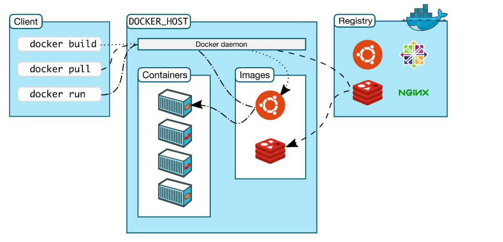

* Docker Architecture

    * Docker uses a **client-server** architecture. The Docker 'client' talks to the Docker daemon, which does the heavy lifting of building, running, and distributing your Docker containers. The Docker client and daemon can run on the same system, or you can connect a Docker client to a remote Docker daemon. The Docker client and daemon communicate using a REST API, over UNIX sockets or a network interface. Another Docker client is Docker Compose, that lets you work with applications consisting of a set of containers. 


* Docker Engine
    * Docker Engie allows you to develop, assemble, ship and run the applications using the following componets.

        * The Docker Daemon (Docker server)
            * A persistent background process that manages Docker Objects. A Docker daemon constantly listens for DOCKER  API requests and processes them.
            * The Docker daemon (dockerd) listens for Docker API requests and manages Docker objects such as images, containers, networks, and volumes. A daemon can also communicate with other daemons to manage docker services.
        * Docker CLI: 
            * A command line interface client for interacting with docker daemon. It greatly simplifies how    you manage container instances.
            * The Docker client (docker) is the primary way that many docker users interact with docker. When you use commnads such as " docker run " the client sends these commands to dockerd, which carries them out. The docker command uses the Docker API, The Docker client can communicate with more than one daemon.
    * Docker registries:
        * A docker registry stores the docker images. Docker Hub is a public registry that anyone can use, and Docker is configured to look for images on Docker Hub by default. You can even run you own private registry.
        * When you use the docker pull or docker run commands, the required imanges are pulled from your configured registry. When you use the docker push command, you image is pushed to your configured registry.

    * **Docker Objects**:
        * When you use Docker, you are creating and using images, containers, network, volumes, plugins, and other objects. This section is brief overview of some of those objects.
        * **Images**
            * An image is a read-only template with instructions for creatig a Docker container. Ofter, an image is based on another image, with some additional customization. For example, you may build an image which is based on the ubuntu image, but installs the Apache Web server and your applications as well as the confiugration details needed to make your application run.
            * You might create your own images or you might only use those created by others and published in a registry. To build your own image, you create a **Dockerfile** with simple syntax for defining the steps needed to create the image and run it. Each instructions in Dockerfile creates a **layer** in the image. When you change the Dockerfile and rebuild the image, only those layers which have changed are rebuilt. This is part of what makes images so lightweight, small, and fast, when compared to other virtulazation techonologies.

        * **Containers**
            * A container is a runnable instance of an images. You can create, stop, move, or delete a container using a Docker API or CLI. You can connect a container to one or more networks, attach storage to it, or even create a new images based on its current state.
            * By default, a container is relatively well isolated from other containers and its host machine. You can control how isolated a container's network, storage, or other undelying subsystems are from other containers or from the host machine.
            * A container is defined by its image as well as any configuration options you provide to it when you create or start it. When a container is removed any changes to its state that are not stored in presistent storage disappear.
            * Example ```docker run ``` command

            The following command run as ubuntu container, attches interactively to your local command-line session, and runs /bin/bash

             `docker run -i -t ubuntu /bin/bash`

             When you run this command, the following happens (assuming you are using the default registry configuration)
             1. If you do ot have the ubuntu image locally, Docker pull it from your configured registry, as though you had run docker pull ubuntu manually.
             2. Docker creates a new container, as though you had run a docker container create command manually.
             3. Docker allocates a read-write filesystem to the container, as its final year. This allows a running container to create or modify files and directories in its filesystem.
             4. Docker creates a network interface to connect the container to the default network, since you did not specify any networking options. This includes assigning IP address to the container. By default, containers can connect to external netwokrs using the host machines network connection.
             5. Docker starts the container and executes /bin/bash. Because the container is running interactively and attached to your terminal (due to the -i and -t flags), you can provide input using your keyboard while the output is logged to your terminal.
             6. When you type exit to terminate the /bin/bash command, the container stops but is not removed. You can start it again or remove it.
* The Underlying Technology
    * Docker is written in the Go programming language and takes advantages of several features of the Linux kernel to deliver its functionality. Docker user a technology called `namespaces` to provide the isolated workspace called the container. When you run a container, Docker creates a set of namespaces for the container.
    * These namespaces provide a layer of isolation. Each aspect of a container runs in a separate namespace and its access is limited to that namespace.


        


