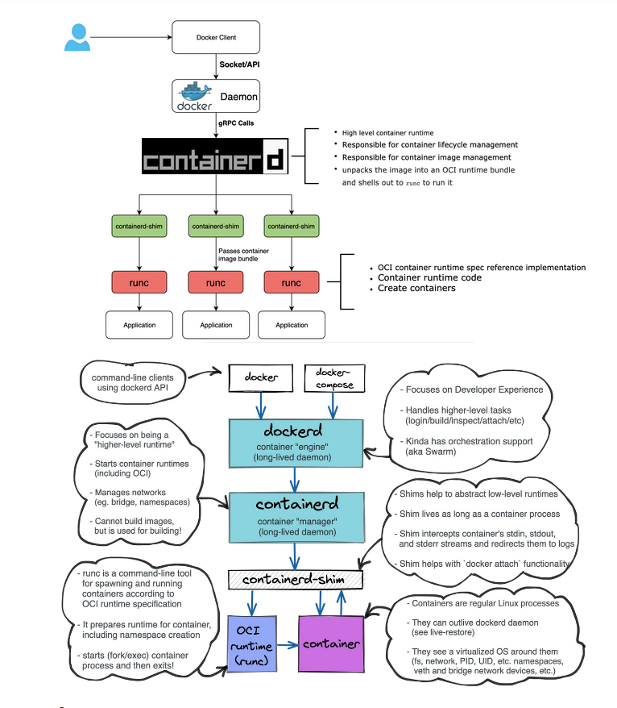

# DOCKER UNDERLYING TECHONOLOGY



* **IMPORTANT TERMS FOR DOCKER**

    ```
    dockerd
    libcontainerd
    containerd
    docker-containerd
    docker-runc
    docker-containerd-ctr
    docker-containerd-shim
    ```

* **dockerd**--> The Docker daemon itself. The highest level component in your list and also the only `Docker` product listed. Provides all the nice UX features of Docker.

* **(docker-) containerd** --> Also a daemon, listeing on a unix socket, exposes gRPC endpoints. Handles all the low-level container managemnet tasks, storage, image distribution, network attachment, etc..
* **(docker-)containerd-ctr**--> A lightweight CLI to directly communicate with **containerd**. Think of it as how `docker` is to `dockerd`.
* **(docker-)runc**--> A lightweight binary for actually running  containers. Deals with the low-level interfacing with Linux capabilities like cgroups, namespaces, etc
* **(docker-)containerd-shim**--> After runC actually runs the container, it exits (allowing us to not have any long-running processes responsibility for our containers). The shim is the component which sits.

```
Docker engine 
containerd
containerd-shm
runC. 

**The binaries are respectively called**

docker
docker-containerd
docker-containerd-shim
docker-runc
```

Refere here(https://stackoverflow.com/questions/46649592/dockerd-vs-docker-containerd-vs-docker-runc-vs-docker-containerd-ctr-vs-docker-c)
Refere here (https://phoenixnap.com/kb/docker-vs-containerd-vs-cri-o)


