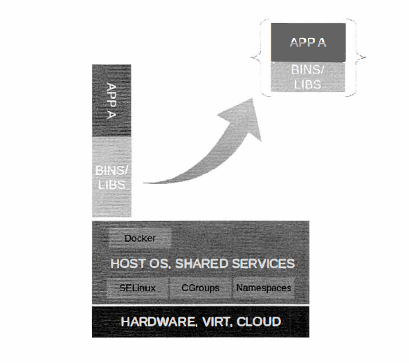

# INTRODUCTION

* What is docker?
    * Docker is an open source platform for building, deploying, and managing containerized applications.
    * Docker is a containerization platform that packages the application and its dependencies together inside a container so that the application works seamlessly in any environment, be it Development, Staging, or Production.
    * It is a tool designed to make it easier to create, deploy, and run applications by using containers. Docker containers are lightweight alternatives to virtual machine, and it uses the host operating system.
    * It is an open-source platform for developers, sysadmins, and enterprises to build, ship and run distributed applications on the fly.
    * Containers are executable units of software in which application code is packaged, along with its libraries and dependencies, in common ways so that it can be run anywhere, whether it be on desktop, traditional IT, or the cloud.

    To do this, containers take advantage of a form of operating system (OS) virtualization in which features of the OS (in the case of the Linux kernel, namely the "**namespaces**" and "**cgroups**" primitives) are leveraged to both isolate processes and control the amount of CPU, memory, and disk that those processes have access to.

* Containers
    * A container is a lightweight application isolation mechanisim that allows the kernel to run groups of processes in their own isolated user spaces, separate from the host system. The container has its own process list, network stack, file sytems, and other resources, but shares the kernel with the host and the other containers running on the system. Linux containers are implemented through a combination of three kernel features: Names spaces for isolation, control groups for resource control, and SELinux for security. 
    * A tool called "**Docker**" is used to create, control, and manage containers. Docker adds an API, an image format, and a delivery and sharing model to linux containers. A Docker image contains an application and all its dependecies. When a container is started, a **read write layer** for that container is combined with the **read-only** image using LVM thin provisioning. Docker images are portable and can be saved and exported to other systems and users.
    

* **Namespaces**
    * The kernel provides container isolation through namespaces, which create a new environment with a unique view of a subset of the resources on the system. Some have called namespaces "**chroot** on steroids," since instead of just providing processes with a different root file system, processes also have a different view of the process table, networking stack, and so on.
    
    * There are five different types of namespaces currently in use by containers : 
        * **Mount** : Isolates the file sytems seen by the container. Containers have a different "/" than each other, and also different than that host systems. 
        * **PID** : Each container has its own process ID (PID) table. Processes inside a container cannot see outside processes, and PID 1 is different in each container. All process in the container are visible from the host, but will have different PID numbers. 
        * **Network** : Each container has its own network interfaces, routing table, and firewall rules, which are not directly visible from the host's default network namespaces or each other. These can be connected to the host's network infrastructure and the outside world. 
        * **IPC** : Isolates the interprocess communications (IPC) resources such as System V shared memory and POSIX message queues. Two containers cannot interact with each other's shared memory spaces. 
        * **UTC** : A container can have a different host name and domain name than other containers and the host system. 
* **Control Groups**
    * Control groups (CGroups) are used by the kernel to manage system resources. CGroups allow fair (or unfair) allocation of CPU time, memory, and I/O bandwidth among processes and groups of processes. Containers use cgroups to manage resource consumption, so that a container will get a certain share of system resources but not steal all system resources.
    * System administators familiar with cgroups should be aware that RHEL7 now users **SYSTEMD** scope and slice units to more easily manage cgroups.
* **chroot**
    * chroot is an old way to limit the directory tree a process (and its subprocesses) can see to a specific subtree. Under normal circumstances, processes cannot see anything outsite the chroot'd directory. This is called a chroot jail. Understanding the concepts of chroot is an important first step to understanding containers, though a typical container does not use chroot. For more on this refere (https://ibug.io/blog/2021/01/linux-container-explained/#chroot)
    

        For more info of namespaces refer here (https://man7.org/linux/man-pages/man7/namespaces.7.html)
        For official docs: (https://docs.docker.com/get-started/)
        For chroot information refer here (https://phoenixnap.com/kb/chroot-jail)
    